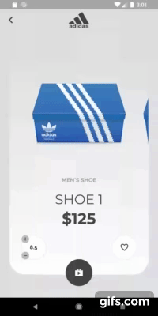

# Implementation of a shoe app design

This is a Flutter/Dart implementation of a shoe app design.
- Designed by [Sang Nguyen](https://dribbble.com/sanggggg)

Below is the my implementation of a shoebox design. I have changed a few things. All that is left if to implement the Flare animatino for the box opening/closing but I do not have the Adobe After Effects animation file to import into Flare.

The first page is a list view of brands for concept realizaion. Each brand will still take you to 
the same one. It is just there to show some idea behind were this main boxe view page could be used.

## Contact Me
- [LinkedIn - Nicholas Mueller](https://www.linkedin.com/in/nicholas-mueller-b12006b6/)
- [Personal Site - Where I mess around with stuff](https://nightmue.github.io/)

A few resources to get you started if this is your first Flutter project:

- [Lab: Write your first Flutter app](https://flutter.dev/docs/get-started/codelab)
- [Cookbook: Useful Flutter samples](https://flutter.dev/docs/cookbook)

For help getting started with Flutter, view our 
[online documentation](https://flutter.dev/docs), which offers tutorials, 
samples, guidance on mobile development, and a full API reference.

